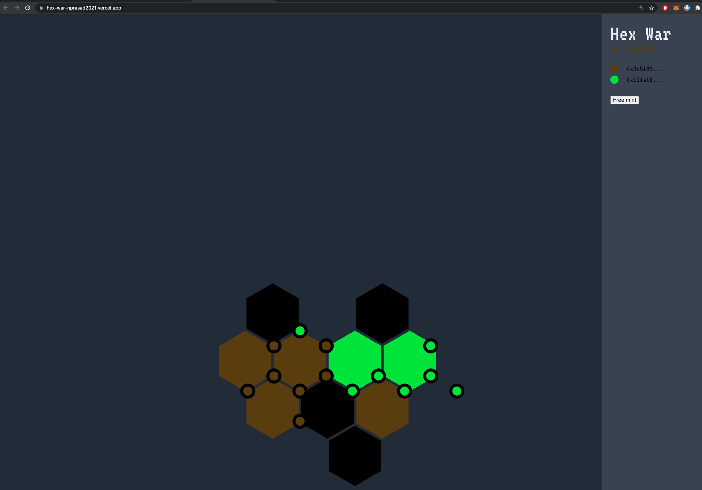

# Hex-War on Optimism
**See the live app at https://hex-war-nprasad2021.vercel.app/**

Conquer a virtual world on Optimism. Grow your holdings by aggressively minting property, forming foreclosures, and outmanuevering your opponents.

## Mechanics
The game world is represented as a hexagonal grid.
Every vertex in the hexagonal grid is represented by a NFT implementing the ERC-721 interface (VertexERC721.sol).
Moreover, while every NFT has a unique tokenId, every NFT is also uniquely represented by a set of three coordinates, corresponding to a position in space.

A user can expand their holdings. NFT holders are able to mint new NFTs only in hex locations directly adjacent to an NFT they currently own. However users are not able to continously mint - a randomized cooldown period prevents constant expansion.

Controlling a hex is valuable. The more NFTs someone owns that are located on the same hex, the lower cooldown periods exist for minting new NFTs.
Thus if someone else owns controls the entire hex, they have a much faster ability to move and expand. Moving fast is important, because it enables users to prevent competitors from controlling their own hexes, or blocking competitors from expanding into new realms.

## Technical Spec
Smart contracts written in solidity, and deployed on Optimism-Goerli testnet. https://goerli-optimism.etherscan.io/address/0x1F45c359A5BBd1896775Cb29D87eb824d59d73A3

All state is completely stored, enforced, and verified on-chain. No backend required.

Inspired by ArtGobblers experiment

